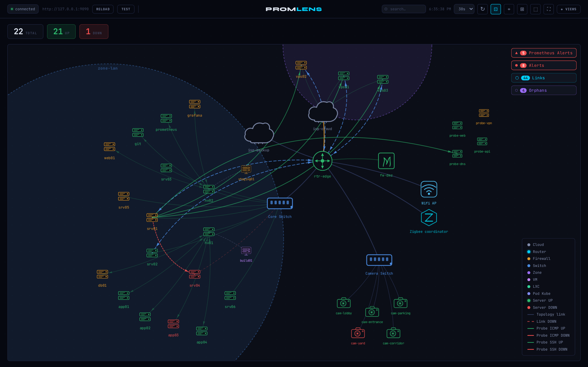
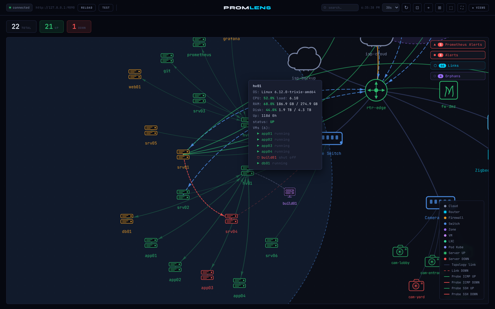
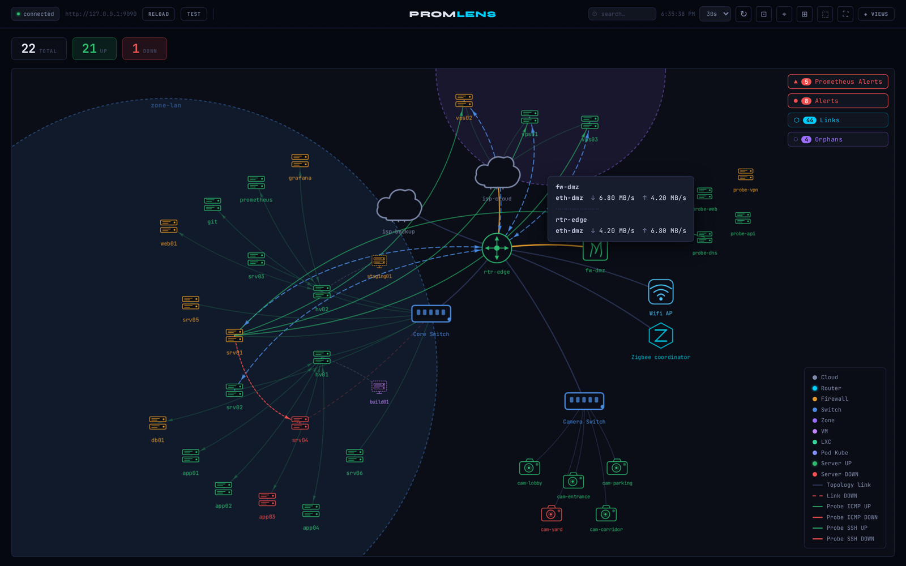
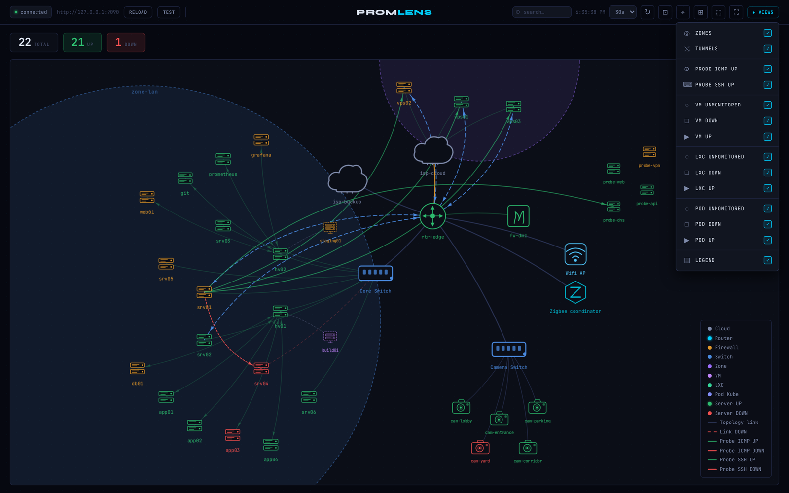
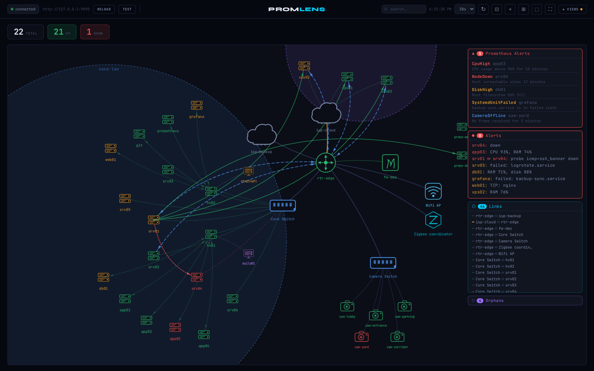
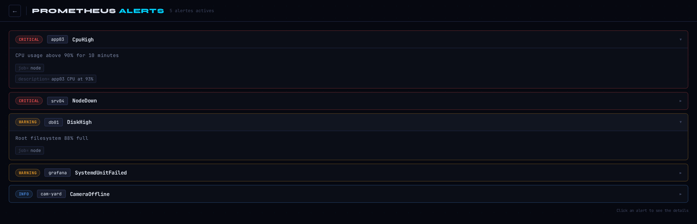

# ProMLens

**English** | [Francais](README.fr.md)

Network topology visualizer that overlays real-time Prometheus metrics on an interactive Vis.js graph.

Version: **0.19.2**

## Screenshots

Every screenshot below runs on the sample configuration shipped in `examples/data/`.

### Topology overview

Static topology nodes, Prometheus hosts attached by zone or hypervisor, WireGuard tunnels,
blackbox probes and Frigate cameras on a single map.



### Node metrics

Hovering a node shows its OS, CPU / RAM / disk usage, load, uptime, failed systemd units,
probe results and — on a hypervisor — the state of every libvirt domain.



### Interface throughput

Hovering a link shows RX/TX per interface on both ends. Links turn orange at 70% and red at
90% of the interface speed.



### Views menu

Toggle zones, tunnels, probe links, the legend, and hide guest nodes (VM / LXC / POD) per
state: unmonitored, down, up.



### Side panels

Prometheus alerts, the alerts ProMLens computes itself, every rendered link and the nodes
with no structural parent.



### Prometheus alerts page

Alerts grouped by node and sorted by severity, expandable to show labels and annotations.



### Reproducing the demo

`examples/mock_prometheus.py` is a stdlib-only mock Prometheus that serves a demo dataset
matching `examples/data/topology.yaml` — no real Prometheus needed.

```bash
# 1. Serve the demo dataset on http://127.0.0.1:9090
python3 examples/mock_prometheus.py &

# 2. Point a copy of the sample config at it
mkdir -p /tmp/promlens-demo
cp examples/data/topology.yaml examples/data/layout.json /tmp/promlens-demo/
sed 's|^url: .*|url: http://127.0.0.1:9090|' examples/data/promlens.yaml > /tmp/promlens-demo/promlens.yaml

# 3. Run ProMLens on it, then open http://127.0.0.1:8000
./run.sh /tmp/promlens-demo/promlens.yaml /tmp/promlens-demo/topology.yaml /tmp/promlens-demo/layout.json
```

## Quick start

### Container (recommended for development)

```bash
# Build and run — mounts examples/data/ for config files
make run

# Open http://127.0.0.1:8001
```

### Debian package (recommended for production)

```bash
# Build the .deb
make deb

# Install
dpkg -i promlens_*.deb

# Edit config files
vim /etc/promlens/promlens.yaml
vim /etc/promlens/topology.yaml

# Start the service
systemctl start promlens
```

Config files go in `/etc/promlens/`. Layout state persists to `/var/lib/promlens/layout.json`.

## promlens.yaml — all fields

```yaml
url: https://prometheus.example.com       # required

auth:
  type: none                              # none | basic | bearer | cert
  username: admin                         # basic only
  password: secret                        # basic only
  token: mytoken                          # bearer only

instance_label: instance                  # label used as node identifier (default: instance)
parent_label: parent                      # label holding the parent node name (default: parent)
guest_label: role                         # label marking a node as a guest (default: job)
guest_values: [vm, lxc]                   # values of guest_label treated as guests (default: [vm])
direct_credentials: false                 # cert mode only: send client cert in direct requests
ssl_verify: true
timeout: 30                               # HTTP timeout in seconds
proxy: http://proxy.example.com:8080      # optional
refresh: 30                               # default auto-refresh interval in seconds (default: 30)

app_auth:
  mode: none                              # none | basic | cert
  htpasswd: /etc/promlens/.htpasswd       # basic mode: path to htpasswd file
  secret: "change-me-random-string"       # session signing key
  session_days: 7

libvirt:                                  # remove section or set enabled: false to disable
  enabled: true
  instance_label: instance

blackbox:                                 # remove section or set enabled: false to disable
  enabled: true
  destination_label: instance             # label identifying the probe target (default: instance)
  source_label: job                       # label identifying the probe source (optional)
  http_node_label: upstream               # label for HTTP/HTTPS probes (default: upstream)
  dest_aliases:                           # alias -> node name for unresolvable probe targets
    mynode:
      - alias-1
      - alias-2

frigate:                                  # remove section or set enabled: false to disable
  enabled: true
  camera_url: https://frigate.example.com  # clicking a camera opens camera_url/#camera_name

webhooks:                                 # remove section or set enabled: false to disable
  enabled: true
  interval: 60                            # poll interval in seconds (default: 60, minimum: 10)
  for_cycles: 2                           # consecutive cycles before notifying (default: 2)
  notify_resolved: true                   # notify when an alert clears (default: true)
  link: https://promlens.example.com/     # value of the payload "url" field
  severities: [critical]                  # only notify these severities (default: all)
  disabled:                               # alertname glob patterns never notified
    - SystemdUnitFailed
    - "*High"
  ca_file: /etc/promlens/webhook-ca.crt   # optional CA bundle to verify the webhook TLS cert
  targets:
    - url: https://notify.example.com/api/notify
      topic: infra
      recipients: [ops, oncall]
      module: promlens
      headers:
        Authorization: "Bearer ${NOTIFY_TOKEN}"   # $VAR / ${VAR} are expanded
```

## topology.yaml — sections summary

| Section | Purpose |
|---|---|
| `nodes` | Static infrastructure nodes (router, switch, cloud, firewall, vm, lxc, kube, zigbee, wifi) |
| `networks` | CIDR ranges that auto-attach Prometheus hosts to a gateway node |
| `zones` | Visual grouping bubbles driven by the Prometheus `zone` label |
| `tunnels` | WireGuard tunnels shown as dashed links with dedicated interface metrics |
| `links` | Interface filter declarations — limit which interfaces appear in link tooltips |
| `cameras` | Override the parent node for specific Frigate cameras by name |

Full reference and examples: see [DOC.md](DOC.md)

## API endpoints

| Method | Path | Description |
|---|---|---|
| `GET` | `/api/config` | Prometheus URL, auth type, enabled integrations |
| `POST` | `/api/query` | Proxy a PromQL instant or range query |
| `GET` | `/api/topology` | Parsed topology.yaml |
| `GET` | `/api/layout` | Saved node positions and view toggles |
| `POST` | `/api/layout` | Save node positions and view toggles |
| `POST` | `/api/reload` | Validate and reload both config files |
| `GET` | `/login` | Login page (basic auth mode only) |
| `POST` | `/api/auth/login` | Authenticate, receive session cookie |
| `POST` | `/api/auth/logout` | Clear session cookie |

## Auth modes (Prometheus connection)

| Mode | How it works |
|---|---|
| `none` | No auth |
| `basic` | Backend adds `Authorization: Basic` header |
| `bearer` | Backend adds `Authorization: Bearer` header |
| `cert` | Browser sends queries directly to Prometheus; client cert handled by the browser |

## Features

- Interactive graph — draggable nodes, zoom/pan, force-directed layout
- Real-time metrics — CPU, RAM, disk, load, uptime in tooltips
- Color-coded nodes — green / orange (>=70%) / red (>=90%), blinking at 100%
- Network links — RX/TX per interface, colored by utilization
- WireGuard tunnels — dashed links with dedicated interface metrics
- Zone bubbles — visual grouping by Prometheus `zone` label
- Blackbox probes — ICMP, SSH, TCP connect, HTTP/HTTPS probe links and per-node status
- Frigate cameras — one node per camera, green=online, red=offline
- Libvirt VMs — VM list with state in hypervisor tooltips
- Guest visibility — hide VM / LXC / POD nodes per state (unmonitored, down, up) from the VIEWS menu
- Search modal — `Ctrl+F` (`Cmd+F` on macOS) opens a command palette over visible nodes and zones, arrows to navigate, Enter to zoom
- Keyboard shortcuts — `Ctrl`/`Cmd` bindings for search, save layout, selection mode, fit, refresh; `Ctrl+H` lists them all in a help modal
- Persistent layout — positions and toggle state saved server-side
- Alert webhooks — server-side notifications for the alerts ProMLens computes itself (thresholds, node down, failed systemd units), no Prometheus alerting rule required
- Config reload — RELOAD button validates and hot-reloads both YAML files
- Security — rate limiting, CSRF protection, CSP headers

## License

MIT — see [LICENSE](LICENSE).

Bundled third-party assets (JetBrains Mono, Syne, vis-network) keep their own licenses:
see [THIRD_PARTY_LICENSES.md](THIRD_PARTY_LICENSES.md).
